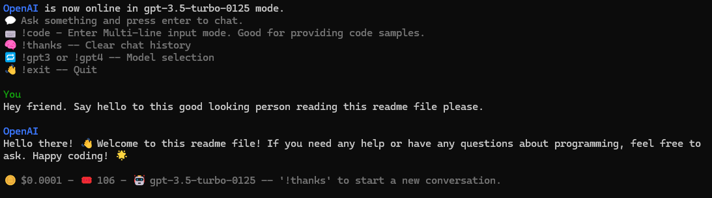
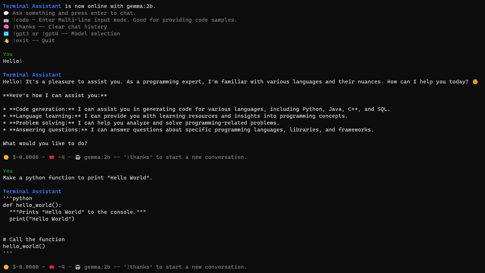

# Terminal AI ASSIST

This simple chatbot leverages either OpenAI or Ollama for its AI capabilities.

OpenAI: Choose from GPT-3.5-Turbo or GPT-4-Turbo models within the app. Estimated costs are shown after each response. Use !thanks to restart conversations and reduce costs.
Ollama: Run the app with `--ollama` and specify your model name in .env (default: "gemma:2b").

Modified code from https://github.com/jiberwabish/Terminal-Assistant to include the functionality of using local LLM models insted of just OpenAI ChatGPT.

## Installation and Setup

1. **Python**: Ensure Python 3.10 or higher is installed on your system.

2. **Dependencies**: Install the required Python packages with the following command:

   ```bash
   pip install openai tiktoken python-dotenv
   ```

   or

   ```bash
   pip install -r requirements.txt
   ```

3. **API Key**: Set your OpenAI API key, Ollama Model, and optionally the Assistant Name in `.env` file like this:

   ```bash
   OLLAMA_MODEL=gemma:2b
   OPEN_AI_KEY=sk-demo
   ASSISTANT_NAME="Terminal AI ASSIST"
   ```

4. **Identity**: Modify the 'identity' variable within the code to change the bot's identity if you wish.

5. **Run the Chatbot**: Start the chatbot with the following command for OpenAI by default:
   ```bash
   python terminal-assistant.py
   ```
   and use the following command for Ollama:
   ```sh
   python terminal-assistant.py --ollama
   ```

> **Note**: This bot uses the newest OpenAI python package and therefore the newer API call. If it's not working for you, you may need to update the package with `pip install --upgrade openai`.

How to Use

Chatting: Simply type your message and hit Enter to engage in a conversation. To start a new topic or clear the previous chat, use !thanks.
Code Input: Use `!code` to enter code snippets that span multiple lines.
Clearing History: Use !thanks to erase the entire conversation history.
Model Selection: Use `!gpt3` or `!gpt4` to choose between different AI models.
Quitting: Use `!exit` to terminate the application.

## Screenshots

#### OpenAI



#### Ollama


